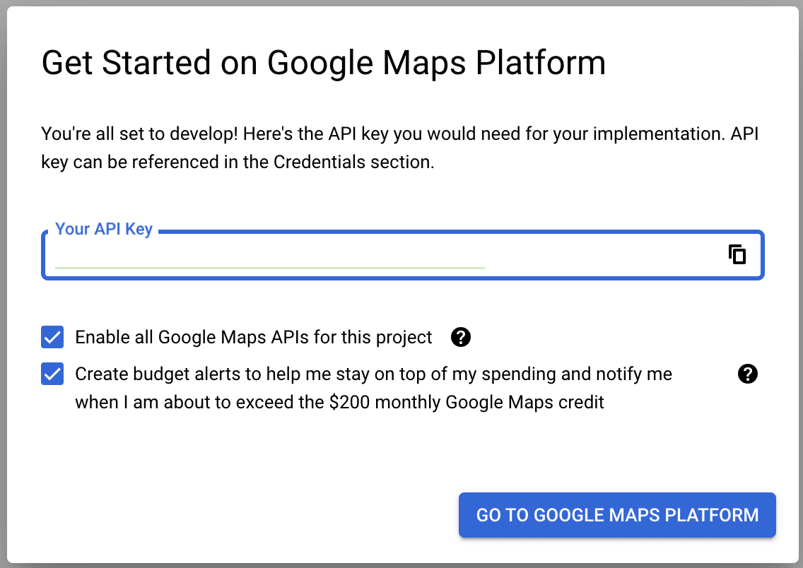

First post in the series of Flutter and Google Maps. In this post, I will cover how to setup Google Maps and prepare your Flutter project to use gmaps.

## Table of contents

## Google Cloud Platform

### Create a project

First, you need to create a project in Google Cloud Platform. Go to [Google Cloud Platform](https://console.cloud.google.com/) and create a new project.

If you already have a project, you can use it, select it from dropdown in the top bar.

### Enable Maps API

In the Navigation menu, go to [Google Maps Platform](https://console.cloud.google.com/google/maps-apis/overview).

On the first open you will be proposed to setup Google Maps Platform.



Copy your API key, you will need it in the next step.

Keep both `Enable all Google Maps APIs for this project` and `Create budget alerts...` checked and click on `GO TO GOOGLE MAPS PLATFORM` button.

Once a Platform setup task is done, you will need to protect your key. For now you can use a simple `IP Addresses` restriction type with your public or local ip address. You can always change it later.

Now it's time to enable maps API. Go to [Google Maps Platform: APIs & Services](https://console.cloud.google.com/google/maps-apis/api-list) and click on `ENABLE` button for next APIs:

-   **Maps SDK for Android** - we will use it for Android app
-   **Maps SDK for iOS** - this one will be used for iOS app
-   **Maps Static API** - we will embed map static images in our app
-   **Geocoding API** - this api will help us to convert address to coordinates and vice versa

## Flutter project

### Add dependencies for Flutter

Use `flutter pub add` command to add dependencies to your project.

-   `http` - we will use it to send rest api requests for Geocoding API
-   `location` - this package will help us to get user's current location
-   `flutter_dotenv` - we will use it to store our API key in a `.env` file
-   `google_maps_flutter` - this package will help us to embed Google Maps in our app

### Setup Secrets

The main goal is to avoid submitting an API key to the source control and keep it in a safe place.

It will also prepare your project for CI/CD flow, where you can use different keys for different environments.

#### Setup Secrets for a Flutter project

For Flutter project, we will use `flutter_dotenv` package to store our API key in a `.env` file.

-   create two new files in the root folder of your project: `.env` and `.env.example`
-   add `.env` file to the `.gitignore` file in the root folder
-   add `GOOGLE_MAPS_API_KEY=` line to `.env.example` file. It will help to remember the key name
-   add `GOOGLE_MAPS_API_KEY=YOUR_API_KEY_VALUE` line to `.env` file. Replace `YOUR_API_KEY_VALUE` with your real API key
-   open `main.dart` file and import `flutter_dotenv` package: `import 'package:flutter_dotenv/flutter_dotenv.dart';`
-   add a new line at the beginning of the `main()` method

```dart
  await dotenv.load(fileName: ".env");
```

-   later in the code, you can access your API key with:

```dart
  final String _apiKey = dotenv.get('GOOGLE_MAPS_API_KEY');
```

Pretty simple setup for a Flutter project, compared to Native code.

#### Setup Secrets for Android and iOS

To correctly handle an API key in the Native code, we will need to make a couple of adjustments.

##### **Android**

Open article [Secrets Gradle plugin](https://developers.google.com/maps/documentation/android-sdk/secrets-gradle-plugin).

Follow this article to install and setup `com.google.android.libraries.mapsplatform.secrets-gradle-plugin:secrets-gradle-plugin` in your Android project.

> Note: Skip watching the video in this article, it's not updated and you will need to redo the setup as in the article.

I won't describe all the parts of the setup, but I will highlight the main steps:

-   add a new dependency `com.google.android.libraries.mapsplatform.secrets-gradle-plugin:secrets-gradle-plugin:2.0.1` (check a current version) to your `build.gradle` file in the root folder (right under `android`)
-   add a plugin `com.google.android.libraries.mapsplatform.secrets-gradle-plugin` in `android/app/build.gradle` file
-   also in the same file, make sure `targetSdk` and `compileSdk` are set to `34` or the one that is recommended at the time you are reading this post.
-   create a new file `android/secrets.properties` and add your API key there as a `key=value` pair
    -   you can follow example in the article and name key as `MAPS_API_KEY` or use any other name, i.e. `GOOGLE_MAPS_API_KEY`
    -   as a value you should use your API key, the one you copied from Google Maps Platform setup step
-   add a new line `secrets.properties` to `.gitignore` file in the root `android` folder
-   update `local.defaults.properties` file in the same folder to include `MAPS_API_KEY=DEFAULT_API_KEY` or `GOOGLE_MAPS_API_KEY=DEFAULT_API` key-value pair
    -   Note: value `DEFAULT_API_KEY` is intentional, don't replace it with your real API key, this step helps to prevent build failure if `secrets.properties` file is missing
-   now navigate to `android/app/src/main/AndroidManifest.xml` and add there a new `meta-data` tag (for correct values check article)
-   finally, navigate to `android/app/build.gradle` and find `secrets` block
    -   if this section is missing - add it
    -   under `secrets` add two new lines:

```bash
    propertiesFileName = "secrets.properties"
    defaultPropertiesFileName = "local.defaults.properties"
```

Okay, that was a long list of actions, but check the article, it's very well written, and you should be able to follow it without any issues.

##### **iOS**

iOS is a bit different from Android, but it's still easy to setup.

My steps to setup iOS secrets are:

-   create two files `Debug.xcconfig` and `Release.xcconfig` in the `ios/Flutter` folder
-   add `Debug.xcconfig` to `.gitignore` file in the root `ios` folder
-   open `Release.xcconfig` and add a new line `GOOGLE_MAPS_API_KEY=$(GOOGLE_MAPS_API_KEY)`. Note: `$(GOOGLE_MAPS_API_KEY)` is evaluated value from environment variables of your or CI/CD runner system
-   open `Debug.xcconfig` and add a new line `GOOGLE_MAPS_API_KEY=YOUR_API_KEY_VALUE`. Note: `YOUR_API_KEY_VALUE` is your real API key, do not wrap it in quotes or use any other symbols.
-   open `Info.plist` file in the `ios/Runner` folder and add a new `key-value` pair under `dict` tag (for convenience you can add it right above `</dict>` tag)

```xml
  <key>googleMapsApiKey</key> # this value is important, we will access it in the code later
  <string>$(GOOGLE_MAPS_API_KEY)</string>
```

-   since we are in the `Info.plist` file, you can also add a new `key-value` pair for `NSLocationWhenInUseUsageDescription` to ask user for permission to use location services

```xml
  <key>NSLocationWhenInUseUsageDescription</key>
  <string>Your current location.</string>
```

-   finally, open `AppDelegate.swift` file in the `ios/Runner` folder and add a new line in the `application` method as a first line

```swift
GMSServices.provideAPIKey(Bundle.main.object(forInfoDictionaryKey:"googleMapsApiKey") as? String ?? "");
```

And we are done setting up iOS secrets.

## Conclusion

In this post, we have created a new project in Google Cloud Platform, enabled Maps API and setup protected handling of our API key both in the Flutter and Native code.

This setup will help you to avoid publishing your API key to the source control and prepare your project for CI/CD flow.
